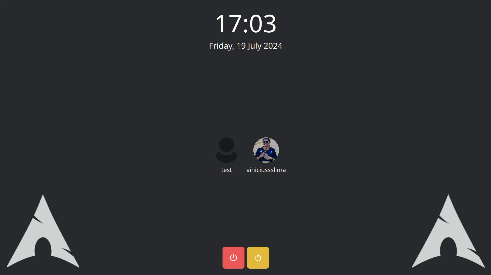
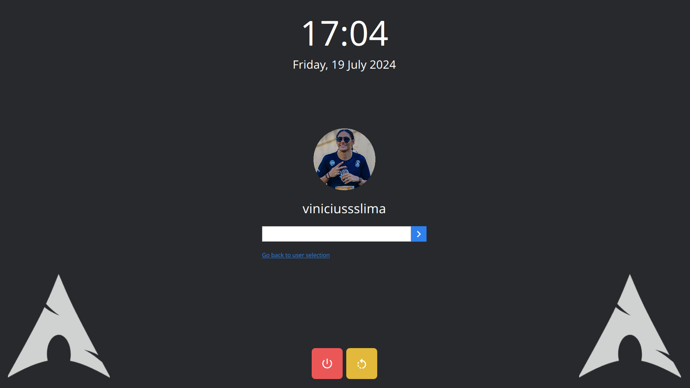

# SDDM-LOGIN

This project is a simple login screen screen for SDDM

## Screenshots

## How to install

1. Clone this project
2. Move the project to the folder `/usr/share/sddm/themes`
3. Update the SDDM config;
   - On the folder `/etc` look for the file `sddm.conf;`
   - On the file look for the `[Theme]` section;
   - On the theme section change `Current` value to the name of the project folder (the default is sddm-login).
4. Restart the SDD service
   - Use the command `systemctl restart sddm.service`
